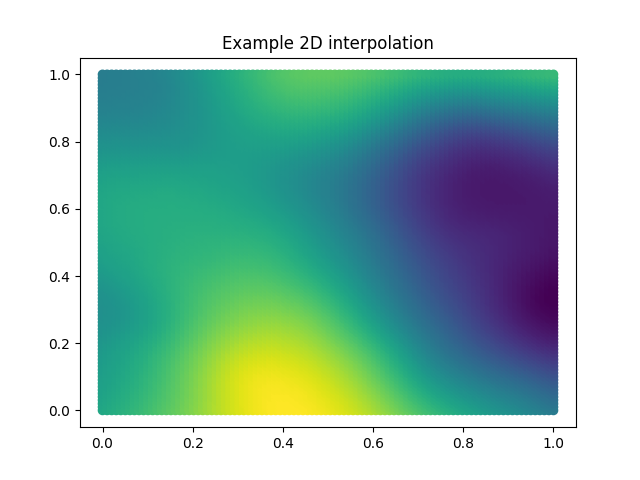
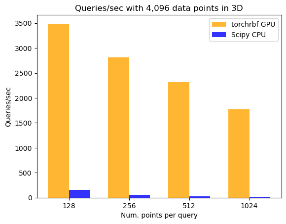

# torchrbf: Radial Basis Function Interpolation in PyTorch

This is a PyTorch module for [Radial Basis Function (RBF) Interpolation](https://en.wikipedia.org/wiki/Radial_basis_function_interpolation), which is translated from [SciPy's implemenation](https://docs.scipy.org/doc/scipy/reference/generated/scipy.interpolate.RBFInterpolator.html). This implementation benefits from GPU acceleration, making it significantly faster and more suitable for larger interpolation problems.

## Installation
```
pip install torchrbf
```

The only dependencies are PyTorch and NumPy. If you want to run the tests and benchmarks, you also need SciPy installed.

## A note on numerical precision
If you are using TF32, you may experience numerical precision issues. TF32 is enabled by default in PyTorch versions 1.7 to 1.11 (see [here](https://pytorch.org/docs/stable/notes/cuda.html#tensorfloat-32-tf32-on-ampere-devices)). To disable it, you can use 
```python
torch.backends.cuda.matmul.allow_tf32 = False
``` 

torchrbf will issue a warning if TF32 is enabled.

## Usage

Here is a simple example for interpolating 3D data in a 2D domain:

```python
import torch
import matplotlib.pyplot as plt
from torchrbf import RBFInterpolator

y = torch.rand(100, 2) # Data coordinates
d = torch.rand(100, 3) # Data vectors at each point

interpolator = RBFInterpolator(y, d, smoothing=1.0, kernel='thin_plate_spline')

# Query coordinates (100x100 grid of points)
x = torch.linspace(0, 1, 100)
y = torch.linspace(0, 1, 100)
grid_points = torch.meshgrid(x, y, indexing='ij')
grid_points = torch.stack(grid_points, dim=-1).reshape(-1, 2)

# Query RBF on grid points
interp_vals = interpolator(grid_points)

# Plot the interpolated values in 2D
plt.scatter(grid_points[:, 0], grid_points[:, 1], c=interp_vals[:, 0])
plt.title('Interpolated values in 2D')
plt.show()
```
<div style="width: 60%; height: 60%; display: block; margin-left:auto; margin-right:auto">

  

</div>

## Performance versus SciPy

Since the module is implemented in PyTorch, it benefits from GPU acceleration. For larger interpolation problems, torchrbf is significantly faster than SciPy's implementation (+100x faster on a RTX 3090):


<div style="width: 60%; height: 60%; display: block; margin-left:auto; margin-right:auto">

  

</div>
